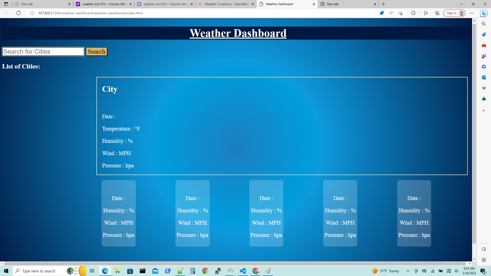
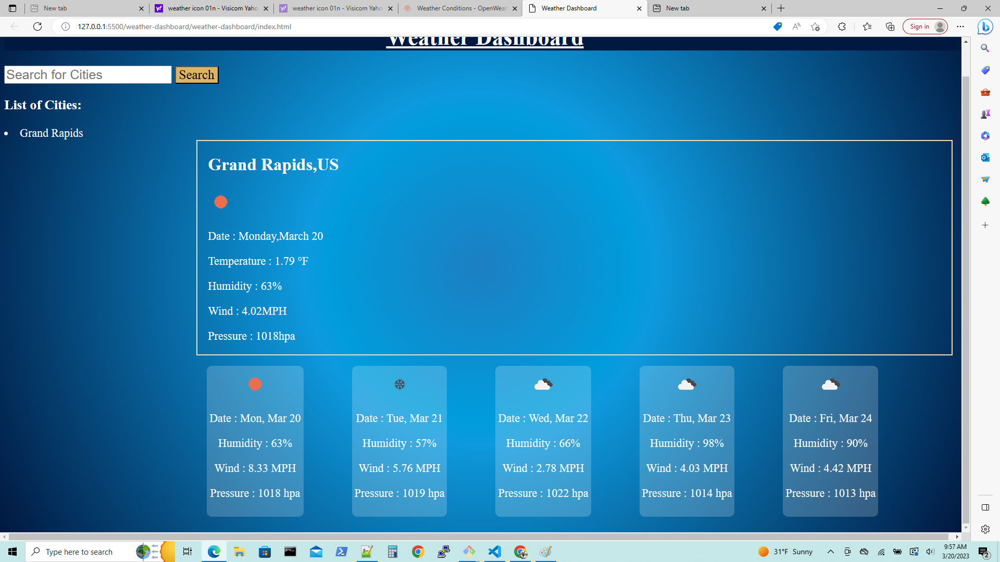
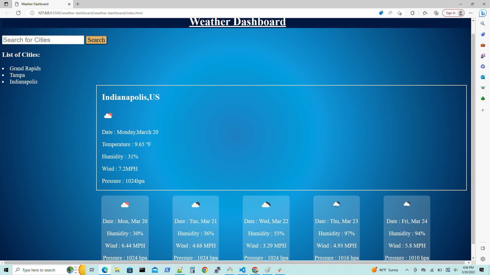
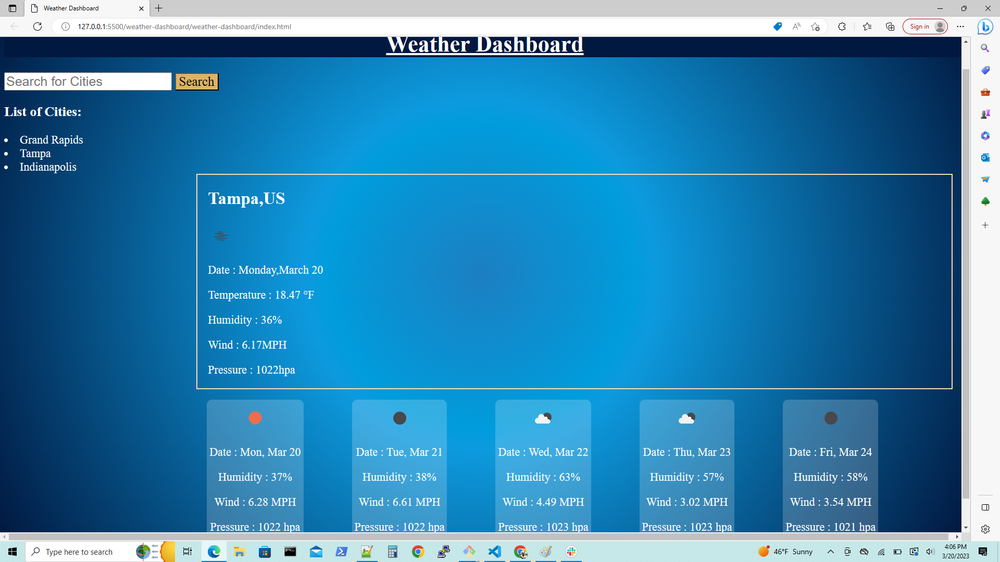
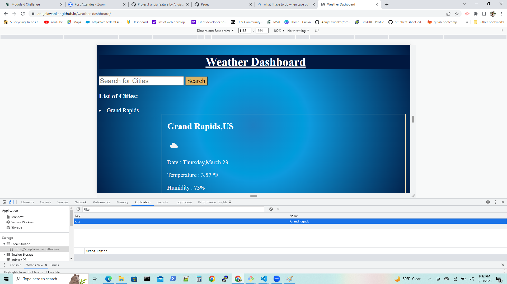

# Weather Dashboard

## Description:-
1. Weather Dashboard is used to weather outlook for multiple cities.

2. On web application weather information of multiple cities is displayed with various formed like Date, wind, pressure, humidity, temperature etc. As well as forecast of five days would also display on Weather Dashboard in formed of cards.

3. In the search field user could search for particular city's weather. when user clicked on search button, the data of weather forecast is displayed in formed of date, wind, pressure, humidity, temperature with weather icon.

4. When user clicked on search button, at he same time weather forecast for next five days would also displayed on web dashboard in formed of date, wind, pressure, humidity, temperature. As well as the weather icon would also displayed regarding weather condition.

5. When user search for another city the search history was displayed on the web page below the search input area.

6. If the user clicked on search history list item. Then weather forecast for that list item would be displayed on the web page.

7. If the user reload the web page still the search history would remain same on the web page. Because it was stored in the local storage.

## Steps I followed:-

1.   First I created the "New Repository" i.e "weather-dashboard" in my GitHub setup.

2.   In GitBash I navigate to the repository where I have to clone my "weather-dashboard" repository. Using "cd" command.

3.   Then I used "git clone <ssh key>" of "weather-dashboard" and clone the repository.
  
4.   Then I created "index.html", "style.css" , "script.js" and "README" files. Using touch command.

5.    Run "code ." command to open VS.

6.    Executed the code.

7.    After that, I added code to GitHub by using "git add -A" command on Gitbash. 
 
8.    Commit the code and add commit message by using "git commit -m <message>".

9.   Pull code by using "git pull origin main".

10.  Push the code by using "git push origin main".

11.  All the final code push in my "weather-dashboard" repository.

12.  For deploy the project , Navigated to "settings tab".

13.  Navigated to pages, in the branch add "main" and "root" .

14.  Finally, "URL" for weather-dashboard is popup.
 

## URLs:-
Here, you can find the webpage.

weather-dashboard web application's deployed URL:-

https://anujalawankar.github.io/6-Weather-Dashboard/

Here, you can find the GitHub URL:-
GitHub URL:- https://github.com/AnujaLawankar/6-Weather-Dashboard

## Technology Used:-
JavaScript, HTML, CSS.

## Assets:-

The following image demonstrates the website appearance:
1. The Weather Dashboard displayed with empty search.

2.Input city name in search field.

3.Weather forecast for particular city name displayed on web page. And also clear the input text area.

4.All cards showing next five days weather forecast for that city name which user entered in search area.

5.List of search history displayed in the left side of web page.

6.If the user want to see weather forecast for already search cities. Then only by clicking on search history city name he could get weather forecast.

7. City names are store in local storage.

